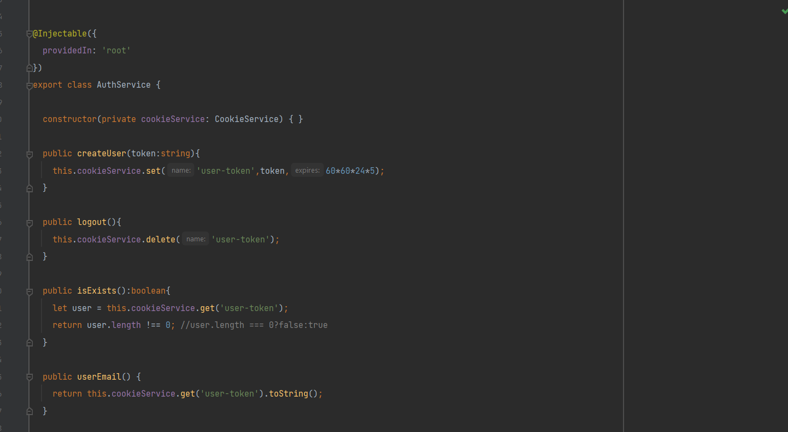
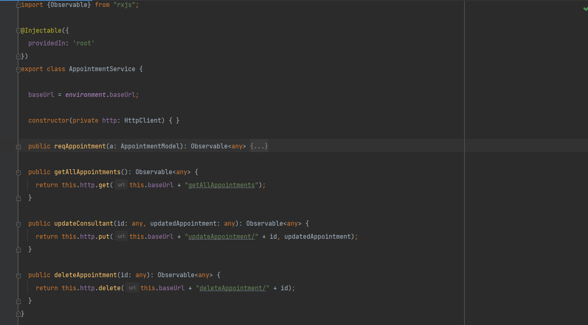
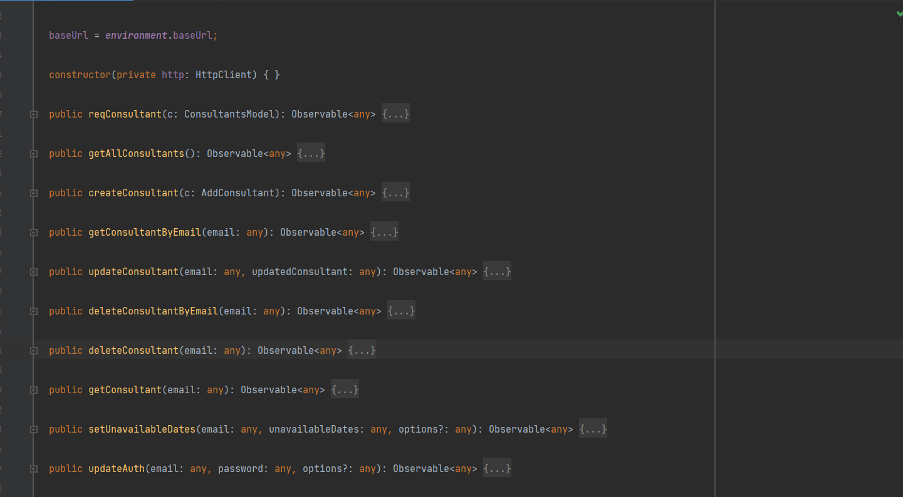
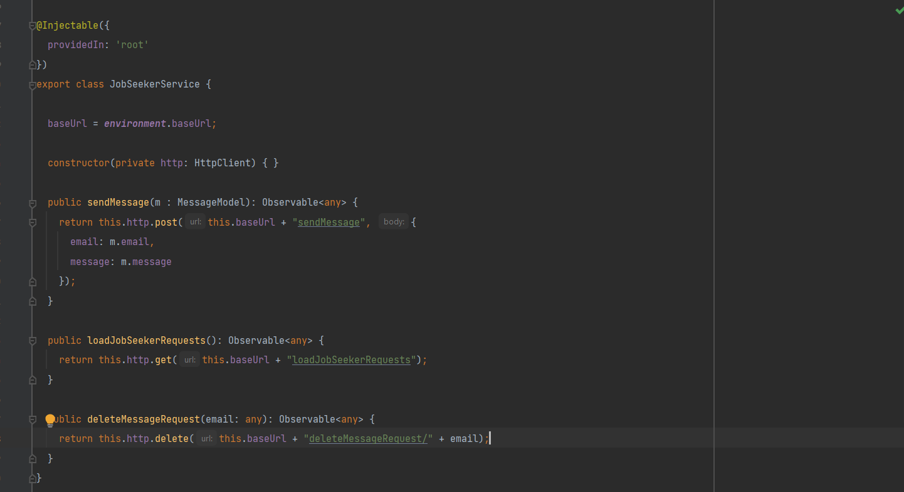
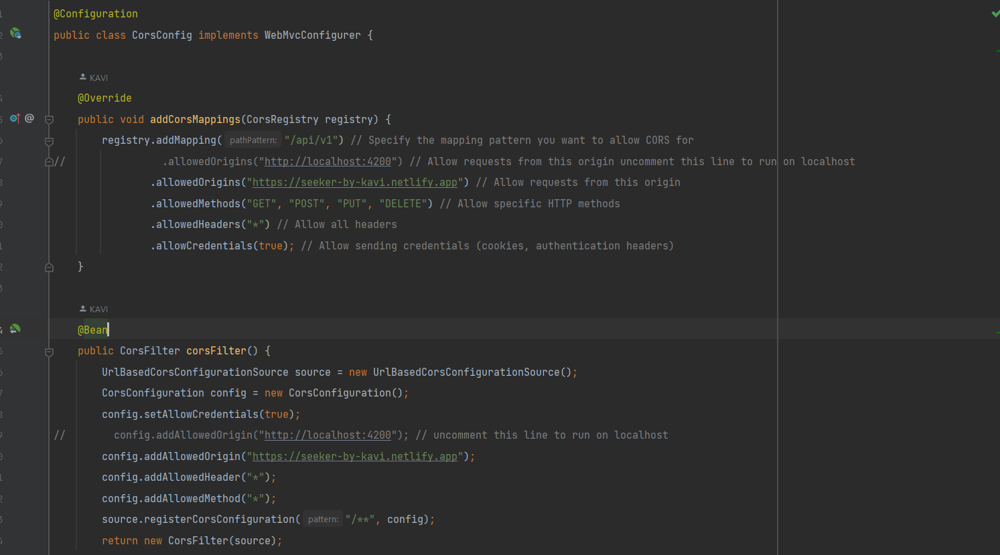
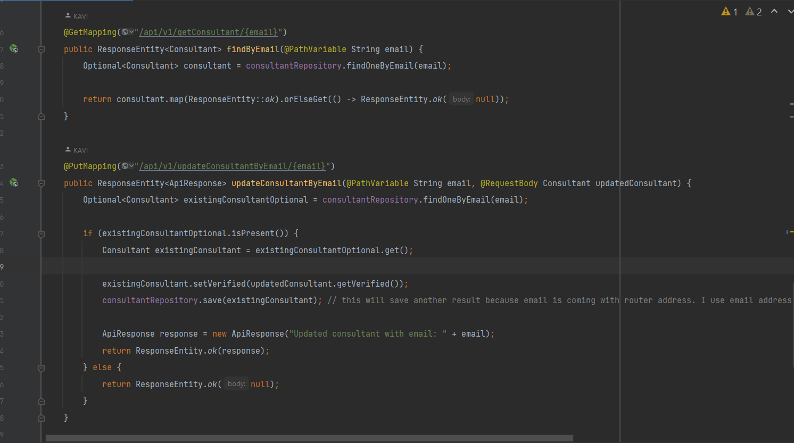
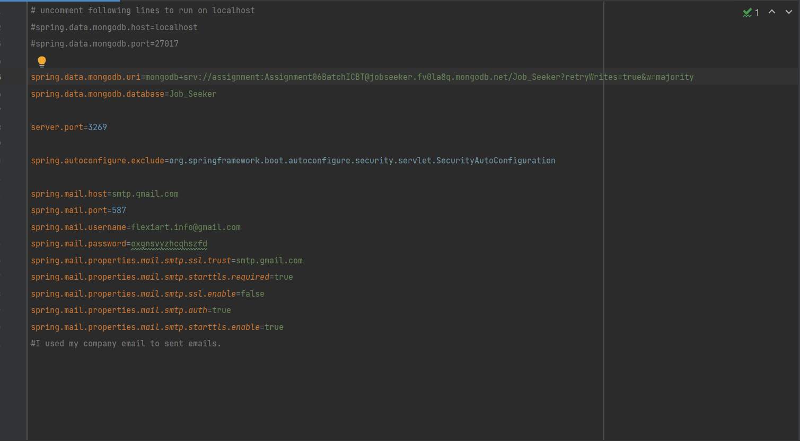
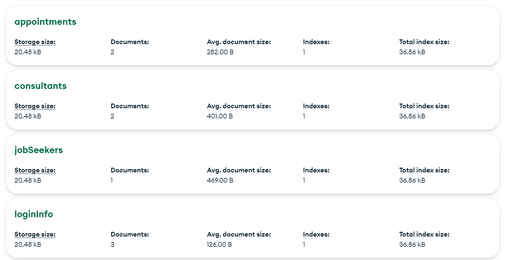

# Technical Documentation

## System Architecture

The Online Appointment Scheduling System is a web-based application built using Spring Boot, Angular, and MongoDB. It
follows a client-server architecture.

## Front-End

The front-end is developed using Angular, providing a user-friendly interface for job seekers, consultants, and
receptionists. It uses Angular services to communicate with the backend and handle user interactions.

## Back-End

The back-end is built with Spring Boot, providing RESTful APIs for user authentication, appointment management, and
communication. MongoDB is used as the database to store user information, appointments, and messages.

## API Documentation

Detailed API documentation can be found in the "api-docs" directory. It provides information on available endpoints,
request formats, and responses.

## Database Schema

The MongoDB database schema consists of collections for users, appointments, messages, and system settings. Refer to
the "database-schema" document for a comprehensive overview.

## Deployment

The application is deployed on a cloud server using Docker and Docker Compose. The deployment process is outlined in
the "deployment-guide" document.
